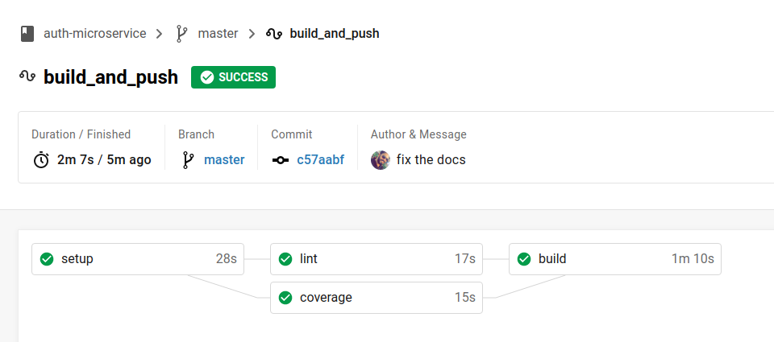

# Authentication Microservice

## Pre-requisites
- Linux machine (ubuntu for example)
- Docker.
- Docker-Compose

## Running locally for development and testing
- Copy `.env-example` to `.env` and set the needed env variables.
- Run `npm run docker` wait until the docker build process let you inside the container
- Run the test cases `npm run test`
- Run the test coverage `npm run coverage`
- Run dev server with hot reload `npm run dev`
- Run the production bundle `npm start`

## Running the container in production server or local to test the app as containers
- Run mongo image by doing the following:
    - `cd ./mongo`
    - `docker-compose up`
- Run `docker-build` that is going to build the docker image tagged with the repository name
- Copy `.env-example` to `.env` and set the needed env variables.
- Run `docker-run` that is going to run the image built in the previous step. 
This script assumes that the `PORT` of the server is `4040` and there is a mongo image running on a docker network called `mongo_default`. 
As well as it assumes that you set the env variables in file called `.env`.

## Linting

- Run `npm run lint`

## Check if the dependencies are up to date
- Run `npm run depcheck`

## Pulling the generated image from docker hub
- `docker pull m3tazite/auth-microservice:1.0.0` this image is auto generated by circle ci and it is ready to use.
if you want to generate a new version from the image, simply do the following
    - Do the changes you need in the code.
    - Open PR in github.
    - Invite someone to review the PR (make sure you have upgrade the **version of package.json**, otherwise you will override the existing image in docker hub)
    - Merge PR
    - Circle ci will automatically run the test, coverage, lint jobs and finally build job which will build the docker image and tag it with **package.json version** then push it to docker hub.

